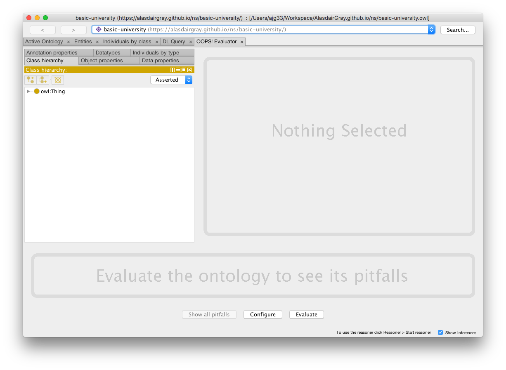
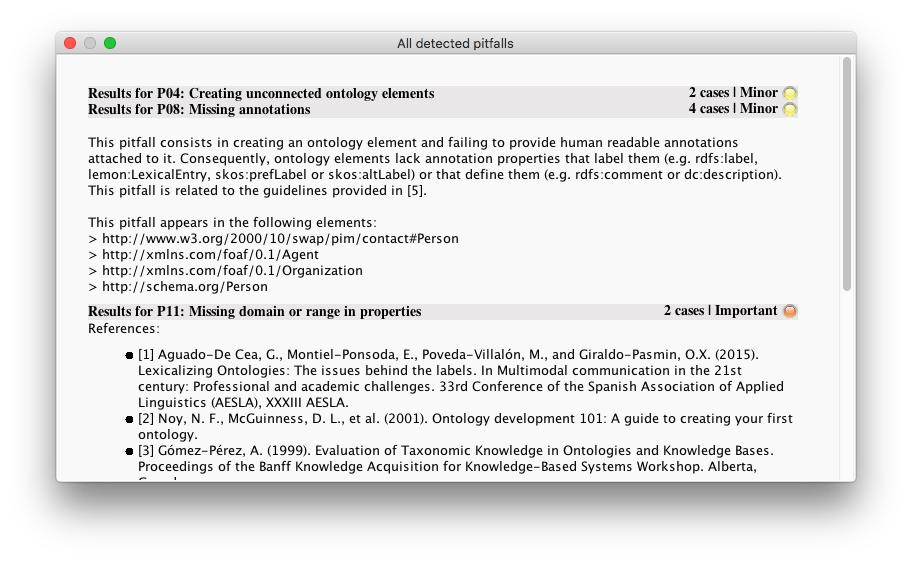

# OOPS Plugin Tutorial
Author: [Alasdair Gray](http://orcid.org/0000-0002-5711-4872)
Contributors: Vanesa Caballero Alonso, Seyed Amir Hosseini

License: [CC-BY](https://creativecommons.org/licenses/by/4.0/)

## Overview

OOPS (Ontology Pitfall Scanner) (Poveda-Villalón et al., 2014) is available as a plugin for Protégé. This tutorial will guide you through installing the plugin and then using it.

## Installation

The OOPS plugin is no longer available through the Protégé plugin system. To install the plugin, download the latest release jar from [here](https://github.com/lukasged/oops-plugin/releases/tag/v1.0.2) and save into the plugins folder in your Protégé installation.

On Linux systems you should have a `.Protege` folder in your home directory if you have already opened up Protégé at some point. Within that folder, create a `plugins` directory and place the jar file there. This works for both the VM and the lab machines.

On Mac, open up the Application folder and right click on Protégé. Click on 'Show Package Contents'. Navigate to 'Contents/Java/plugins' and place the jar there.

On Windows 10, downloaded the jar file from the above link and put it into the plugins folder under Protege-5.5.0-win (the file for the installation of Protege). Then followe the steps in the tutorial. You can also check you have correctly installed the plugin when you open Protege: Go to File -> Preferences -> Plugin Tab, and explore the list of installed plugins. 

Now when you open Protégé the OOPS plugin will be available.

## OOPS Tab

To make the OOPS Tab available, go to 'Window -> Tabs -> OOPS! Evaluator'. You should now have a new tab that provides the OOPS functionality.

## OOPS Usage

Click on the 'Configure' button at the bottom of the OOPS! Evaluator tab.

Click on 'Select all' from the pop up window and then close the pop up.

Now click on the 'Evaluate' button to run the evaluation. 

You can view pitfalls for a specific entity by clicking on the entity. Alternatively, click on the 'Show all pitfalls' button to get details of all the pitfalls that were detected. You can click on the results at the top to expand the section and get details of the problem, see screenshot below.

## References

Poveda-Villalón, María, Asunción Gómez-Pérez, and Mari Carmen Suárez-Figueroa. "OOPS!(Ontology Pitfall Scanner!): An on-line tool for ontology evaluation." International Journal on Semantic Web and Information Systems (IJSWIS) 10.2 (2014): 7-34. doi: [10.4018/ijswis.2014040102](https://doi.org/10.4018/ijswis.2014040102)
