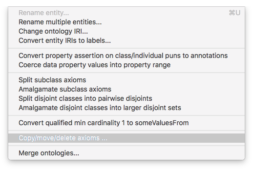

# Ontology Imports
Author: [Alasdair Gray](http://orcid.org/0000-0002-5711-4872)

License: [CC-BY](https://creativecommons.org/licenses/by/4.0/)

## Overview

OWL has a mechanism for importing terms from an existing ontology. The general approach is to declare an `import` in the ontology. This will import the whole of the external ontology into your ontology. See [Importing Ontologies in Protege and OWL 2](https://protegewiki.stanford.edu/wiki/Importing_Ontologies_in_P41) for more details.

This is not always the desired behaviour. Sometimes we only want to include certain classes and properties that are going to be used within the scope of the ontology that you are developing. The rest of this tutorial is based on this assumption and is inspired by the answer to [this](https://stackoverflow.com/questions/44205661/how-to-import-specific-classes-and-object-properties-from-an-ontology-in-protege/44266590) Stack Overflow question.

## Reusing Selected Entities

In this tutorial we are going to reuse some terms from the [`FOAF` ontology](http://xmlns.com/foaf/spec/). 

Note that if you already have an ontology into which you are importing the axioms, then you should first open that  ontology before following the steps below.

### Opening the FOAF Ontology

First we need to open the ontology from which we will be reusing the terms. We first open Protégé and then select the 'File -> Open from URL' option. If you are copy axioms into an existing ontology, then you need to do this in the same window.

Enter the URI `http://xmlns.com/foaf/spec/` and click OK.

That should open the ontology using the latest version specified on the Web. Note that there will be a series of errors logged in the Protégé log file about the 'Illegal redeclaration of entities'. These can be safely ignored. Click on the red icon in the top right of the screen to view and clear the error.

### Importing Selected Entities

To import only the terms of interest, we need to use the 'Refactor -> Copy/move/delete axioms ...'  menu option.

From the resulting pop-up window, select the 'Axioms by reference' option and click Continue. This option imports the properties associated with a class as well as the relevant sections of the class hierarchy.

Select the desired classes that you want to import. In this example we are importing `Person` that is nested under `Agent` as this is the `FOAF` definition of a person and not one from an equivalent ontology.

To ensure that the labels for all entities are also imported we need to go to the 'Annotation Properties' tab and select the `rdfs:label` and `rdfs:comment` properties for inclusion. You can select other properties if they are relevant for your uses.

When you click on Continue you will be able to review the Axioms that will be included in the import. This essentially allows you to see the classes, object and data properties, and annotations that are included.

Next we select that we are going to 'Copy axioms'.

Finally, we choose where we are going to copy the axioms to. In this case we are going to create a new ontology, but if you have already started your ontology then you can choose an existing ontology (note that you will need to have the ontology already open in the same window).

### Final Result

You should now have an ontology that looks something like the following screenshot.

If you find that there are more entities than you desired, you can always delete them. 

You should now save your ontology.
