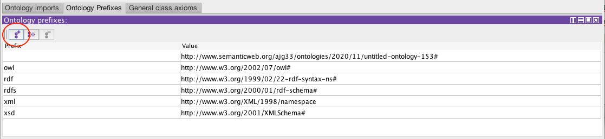
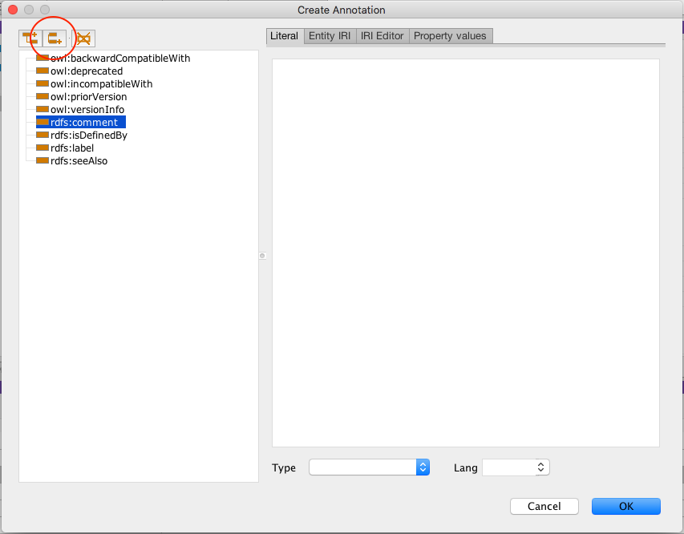
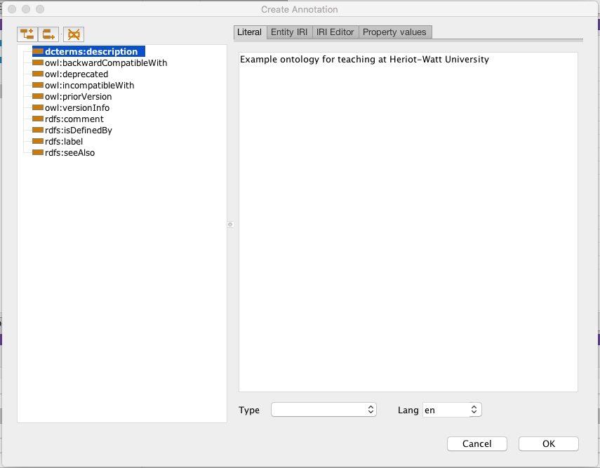
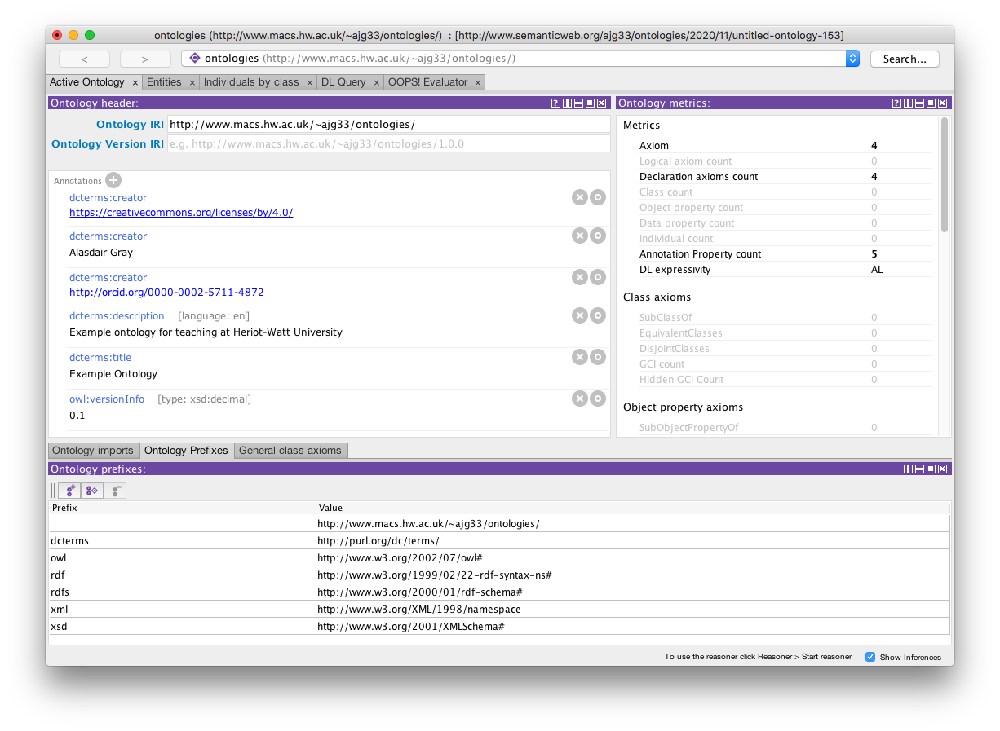

# Ontology Metadata in Protégé

Author: [Alasdair Gray](http://orcid.org/0000-0002-5711-4872)

License: [CC-BY](https://creativecommons.org/licenses/by/4.0/)

## Overview

In this tutorial we will use the Dublin Core Terms vocabulary ([dcterms](http://purl.org/dc/terms/)) to document our ontology.

## Declare `dcterms` Prefix

In the 'Ontology Prefixes' tab, click on the 'Add prefix mapping' icon (circled in the screenshot below).

Add the mapping to the table with `dcterms` as the prefix and `http://purl.org/dc/terms/` for the value.

## Add Annotations

Click on the '+' symbol in the 'Annotations' pane.

In the popup window, click on the 'Add sibling property' icon (circled in the screenshot below).

Type in the property that you want to add to the 'Name' field, e.g. `dcterms:description`. Click on your new term and then add the value in the 'Literal' pane. It is good practice to declare a language if that is appropriate for your property.

We can repeat this process for the properties:

- `dcterms:title` to provide the title of your ontology.

- `dcterms:creator` to provide the name of the person or persons who created the ontology. You should use an IRI if available or both. To provide an IRI use the 'IRI Editor' pane.

- `dcterms:license` to provide the license of your ontology.

We can also use the inbuilt properties, e.g. `owl:versionInfo` for defining the version number of our ontology.

By the end of these steps you should have something that looks like the following screenshot. Note that I've also changed the 'Ontology IRI' to a namespace that I control.

